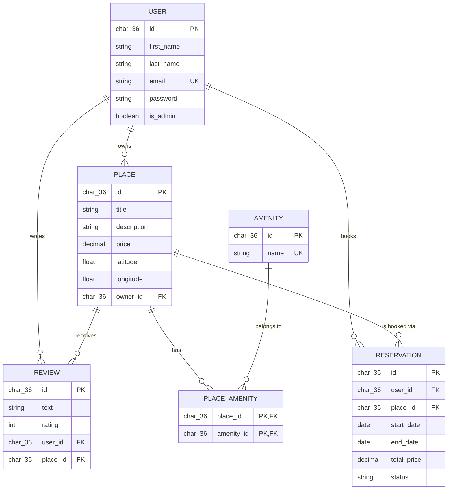

# HBnB — Experimental ER Diagram (Draft `Reservation` Entity)

**Status: experimental / not part of the official schema.** This is a
sketch for a possible future `Reservation` (booking) entity and is kept
separate from `erDiagram.md' so it doesn't get
mistaken for the current, implemented schema.

## Draft relationships

- **User → Reservation (one-to-many):** one `User` can make many
  `Reservation` records; each `Reservation` belongs to exactly one
  `User` via `reservations.user_id`.
- **Place → Reservation (one-to-many):** one `Place` can have many
  `Reservation` records booked against it; each `Reservation` belongs to
  exactly one `Place` via `reservations.place_id`.

## Open questions before this could move to the official schema

- Should overlapping date ranges for the same `place_id` be rejected at
  the database level (e.g. an exclusion constraint) or in the business
  logic layer?
- Does `status` need to be an enum (`pending`, `confirmed`, `cancelled`)
  enforced with a `CHECK` constraint?
- Is `total_price` computed and stored, or derived on read from
  `place.price` and the date range?
