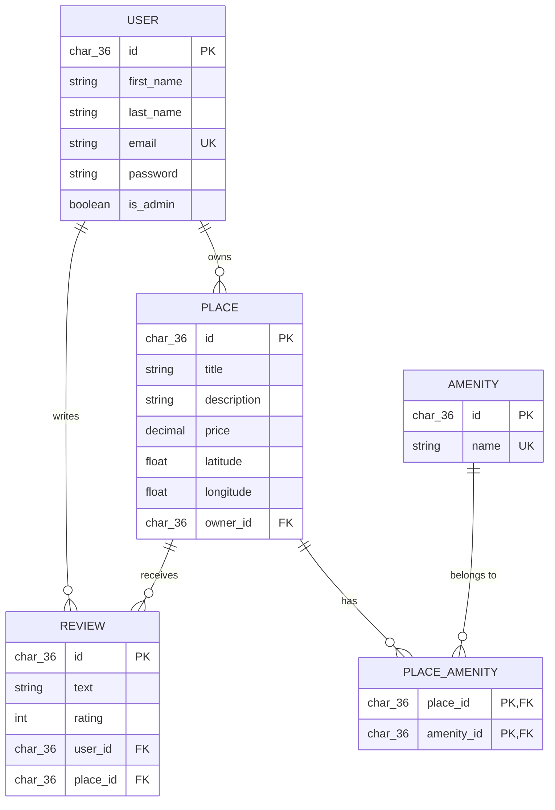

# HBnB — Database ER Diagram

This diagram documents the database schema defined in
`schema.sql`. It mirrors the `User`, `Place`,
`Review`, and `Amenity` models in `app/models/`, plus the `place_amenity`
join table used for the many-to-many place/amenity relationship.

## Relationships

- **User → Place (one-to-many):** one `User` owns many `Place` records;
  each `Place` belongs to exactly one `User` via `places.owner_id`.
- **User → Review (one-to-many):** one `User` writes many `Review`
  records; each `Review` belongs to exactly one `User` via
  `reviews.user_id`.
- **Place → Review (one-to-many):** one `Place` receives many `Review`
  records; each `Review` belongs to exactly one `Place` via
  `reviews.place_id`. The `(user_id, place_id)` pair is unique, so a user
  can only review a given place once.
- **Place ↔ Amenity (many-to-many):** one `Place` can have many
  `Amenity` records, and one `Amenity` can belong to many `Place`
  records, resolved through the `place_amenity` join table with a
  composite primary key on `(place_id, amenity_id)`.
