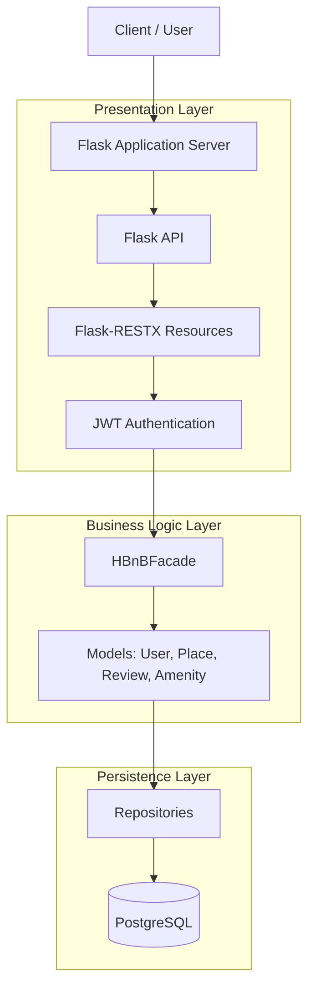

# HBNB

## High-Level Architecture

The HBnB backend uses a layered architecture to keep API handling, business rules, and database access separated.

- **Presentation Layer (Services, API):** This layer handles the interaction between the user and the application. It includes all the services and APIs that are exposed to the users.
- **Business Logic Layer (Models):** This layer contains the core business logic and the models that represent the entities in the system, such as `User`, `Place`, `Review`, and `Amenity`.
- **Persistence Layer:** This layer is responsible for data storage and retrieval, interacting directly with the database.

## Facade Pattern

The `HBnBFacade` provides a single entry point between the Presentation Layer and the Business Logic Layer. API resources call the facade instead of directly accessing models or persistence logic, which keeps the application easier to maintain and extend.

## Package Diagram

## Technology Stack

- Python
- Flask API
- Flask-RESTX
- Flask application server
- JWT authentication
- PostgreSQL

## Required API Calls

### Authentication

- `POST /api/auth/login` - authenticate a user and return a JWT.

### Users

- `POST /api/users` - create a user.
- `GET /api/users` - list all users.
- `GET /api/users/{user_id}` - get one user.
- `PUT /api/users/{user_id}` - update a user.
- `DELETE /api/users/{user_id}` - delete a user.

### Places

- `POST /api/users/{user_id}/places` - create a place for a user.
- `GET /api/places` - list all places.
- `GET /api/users/{user_id}/places` - list places owned by a user.
- `GET /api/places/{place_id}` - get one place.
- `PUT /api/users/{user_id}/places/{place_id}` - update a user's place.
- `DELETE /api/users/{user_id}/places/{place_id}` - delete a user's place.

### Reviews

- `POST /api/reviews` - create a review.
- `GET /api/places/{place_id}/reviews` - list reviews for a place.
- `GET /api/reviews/{review_id}` - get one review.
- `PUT /api/reviews/{review_id}` - update a review.
- `DELETE /api/reviews/{review_id}` - delete a review.

### Amenities

- `POST /api/amenities` - create an amenity.
- `GET /api/amenities` - list all amenities.
- `GET /api/amenities/{amenity_id}` - get one amenity.
- `PUT /api/amenities/{amenity_id}` - update an amenity.
- `DELETE /api/amenities/{amenity_id}` - delete an amenity.
