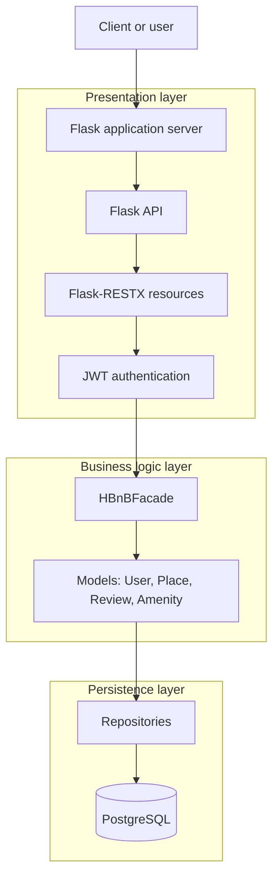

# HBNB

## High-level architecture

The HBnB backend uses a layered architecture to separate API handling, business rules, and database access. Each layer has a clear responsibility, which makes the application easier to test, maintain, and extend.

- **Presentation layer (services and API):** Receives user requests and returns API responses. This layer includes the Flask API and Flask-RESTX resources that users interact with. For example, when a client sends `POST /api/users`, a Flask-RESTX resource receives the request, checks the request format, and passes the data to the facade.

- **Business logic layer (models):** Applies the core business rules and defines the main entities, such as `User`, `Place`, `Review`, and `Amenity`. For example, before the application creates a `Place`, this layer checks that the owner exists, the price is valid, and the latitude and longitude are in range.

- **Persistence layer:** Stores and retrieves data from the database. For example, after the business logic validates a new user, the repository saves the user record to PostgreSQL and retrieves it later for `GET /api/users/{user_id}`.

In practice, a request moves through the layers like this: the API receives the request, the facade calls the correct business logic, and the repository stores or retrieves the data from the database.

## Facade pattern

The `HBnBFacade` provides a single entry point between the presentation layer and the business logic layer. API resources call the facade instead of directly accessing models or persistence logic. This separation makes the application easier to maintain and extend.

## Package diagram

## Diagrams

The detailed diagrams are stored in separate files:

- [Class diagram](diagrams/classDiagram.md)
- [Entity relationship diagram](diagrams/erDiagram.md)
- [Sequence diagram](diagrams/sequenceDiagram.md)

## Technology stack

- Python
- Flask API
- Flask-RESTX
- Flask application server
- JWT authentication
- PostgreSQL

## Required API calls

### Authentication

| Method | Endpoint | Purpose |
| --- | --- | --- |
| `POST` | `/api/auth/login` | Authenticates a user and returns a JWT. |

### Users

| Method | Endpoint | Purpose |
| --- | --- | --- |
| `POST` | `/api/users` | Creates a user. |
| `GET` | `/api/users` | Lists all users. |
| `GET` | `/api/users/{user_id}` | Retrieves a user. |
| `PUT` | `/api/users/{user_id}` | Updates a user. |
| `DELETE` | `/api/users/{user_id}` | Deletes a user. |

### Places

| Method | Endpoint | Purpose |
| --- | --- | --- |
| `POST` | `/api/users/{user_id}/places` | Creates a place for a user. |
| `GET` | `/api/places` | Lists all places. |
| `GET` | `/api/users/{user_id}/places` | Lists places owned by a user. |
| `GET` | `/api/places/{place_id}` | Retrieves a place. |
| `PUT` | `/api/users/{user_id}/places/{place_id}` | Updates a user's place. |
| `DELETE` | `/api/users/{user_id}/places/{place_id}` | Deletes a user's place. |

### Reviews

| Method | Endpoint | Purpose |
| --- | --- | --- |
| `POST` | `/api/reviews` | Creates a review. |
| `GET` | `/api/places/{place_id}/reviews` | Lists reviews for a place. |
| `GET` | `/api/reviews/{review_id}` | Retrieves a review. |
| `PUT` | `/api/reviews/{review_id}` | Updates a review. |
| `DELETE` | `/api/reviews/{review_id}` | Deletes a review. |

### Amenities

| Method | Endpoint | Purpose |
| --- | --- | --- |
| `POST` | `/api/amenities` | Creates an amenity. |
| `GET` | `/api/amenities` | Lists all amenities. |
| `GET` | `/api/amenities/{amenity_id}` | Retrieves an amenity. |
| `PUT` | `/api/amenities/{amenity_id}` | Updates an amenity. |
| `DELETE` | `/api/amenities/{amenity_id}` | Deletes an amenity. |
