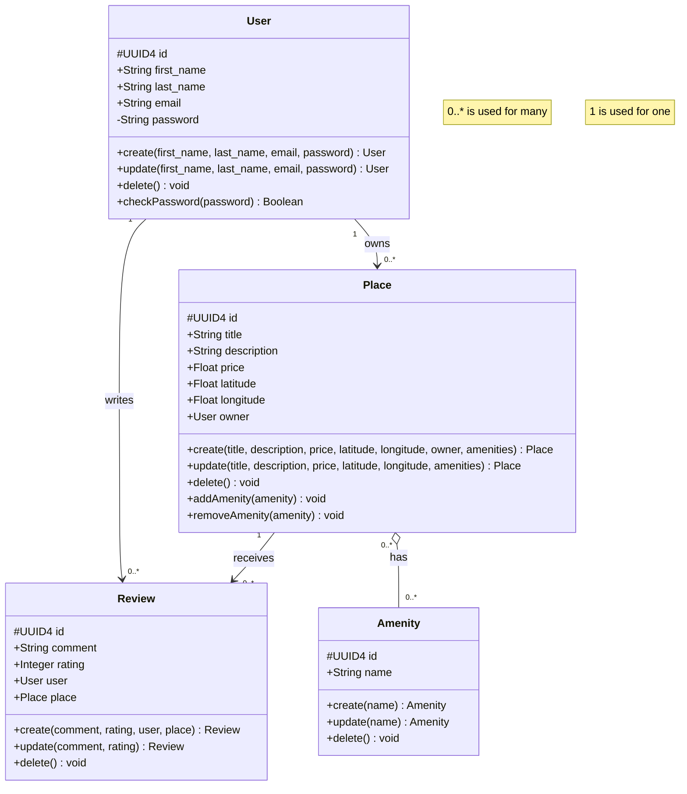

```mermaid
classDiagram
    note "0..* is used for many"
    note "1 is used for one"

class User {
    #UUID4 id
    +String first_name
    +String last_name
    +String email
    -String password

    +create(first_name, last_name, email, password) User
    +update(first_name, last_name, email, password) User
    +delete() void
    +checkPassword(password) Boolean
}

class Place {
    #UUID4 id
    +String title
    +String description
    +Float price
    +Float latitude
    +Float longitude
    +User owner

    +create(title, description, price, latitude, longitude, owner, amenities) Place
    +update(title, description, price, latitude, longitude, amenities) Place
    +delete() void
    +addAmenity(amenity) void
    +removeAmenity(amenity) void
}

class Review {
    #UUID4 id
    +String comment
    +Integer rating
    +User user
    +Place place

    +create(comment, rating, user, place) Review
    +update(comment, rating) Review
    +delete() void
}

class Amenity {
    #UUID4 id
    +String name

    +create(name) Amenity
    +update(name) Amenity
    +delete() void
}

User "1" --> "0..*" Place : owns
User "1" --> "0..*" Review : writes
Place "1" --> "0..*" Review : receives
Place "0..*" o-- "0..*" Amenity : has
```