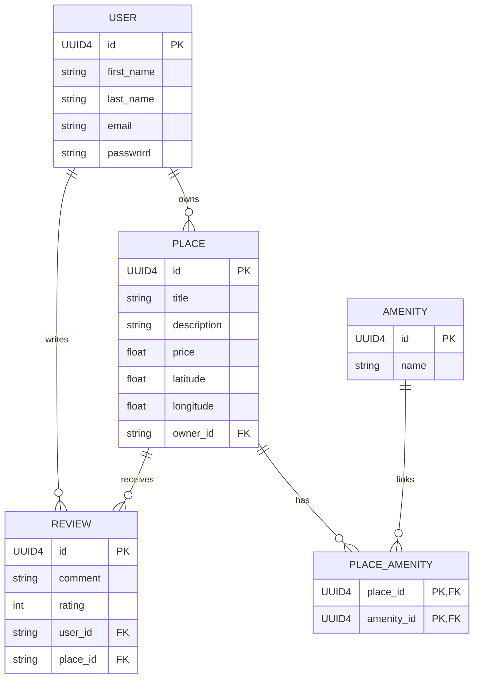

```mermaid
erDiagram
    USER ||--o{ PLACE : owns
    USER ||--o{ REVIEW : writes
    PLACE ||--o{ REVIEW : receives
    PLACE ||--o{ PLACE_AMENITY : has
    AMENITY ||--o{ PLACE_AMENITY : links

    USER {
        UUID4 id PK
        string first_name
        string last_name
        string email
        string password
    }

    PLACE {
        UUID4 id PK
        string title
        string description
        float price
        float latitude
        float longitude
        string owner_id FK
    }

    REVIEW {
        UUID4 id PK
        string comment
        int rating
        string user_id FK
        string place_id FK
    }

    AMENITY {
        UUID4 id PK
        string name
    }

    PLACE_AMENITY {
        UUID4 place_id PK, FK
        UUID4 amenity_id PK, FK
    }
```